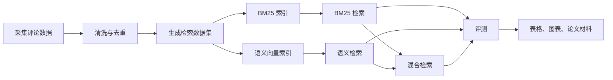

# InformationSearch 项目报告

## 1. 这个项目是做什么的

InformationSearch 是一个“商品评论检索实验平台”。它把电商平台上的用户评论整理成一个可检索的数据集，然后比较三种检索方法：

- BM25 关键词检索：适合查明确关键词，例如“机械键盘”“护眼台灯”。
- 语义检索：把评论和查询转成向量，适合理解更口语化的需求，例如“宿舍晚上写论文想要不吵室友的键盘”。
- 混合检索：把 BM25 和语义检索的结果融合，兼顾关键词命中和语义理解。

最终目标不是做一个网页搜索框，而是搭建一套可以复现实验、输出指标、生成图表和支撑论文写作的命令行实验流程。

## 2. 适合谁看

这个项目适合以下场景：

- 想了解“商品评论如何变成检索系统”的初学者。
- 想比较传统检索和语义检索效果的同学。
- 想复现论文实验流程的人。
- 想基于小米商城评论做需求理解、用户反馈分析的人。

## 3. 项目整体框架



一句话理解：先把评论变干净，再建索引，再查，再评价查得好不好。

## 4. 目录说明

| 目录 | 作用 |
| --- | --- |
| `configs/` | 放实验配置，例如 embedding 模型、top-k、融合权重 |
| `data/raw/` | 原始评论数据 |
| `data/processed/` | 清洗后的数据和检索用数据 |
| `data/annotations/` | 人工标注的查询、相关评论、相关商品 |
| `src/` | 核心 Python 代码，负责检索、融合、评测、工具函数 |
| `scripts/` | 命令行入口，负责采集、预处理、建索引、检索、评测、可视化 |
| `outputs/` | 已生成的索引、检索结果、评测结果、图表 |
| `tests/` | 自动化测试，保证项目能跑通 |
| `docs/` | 设计文档、实施计划和本报告 |

## 5. 核心技术

### 5.1 数据处理

项目使用 `pandas` 读取和处理 CSV/Parquet 数据。核心评论字段是：

| 字段 | 含义 |
| --- | --- |
| `review_id` | 评论 ID |
| `product_id` | 商品 ID |
| `product_name` | 商品名称 |
| `category` | 商品类别 |
| `clean_text` | 清洗后的评论文本 |

### 5.2 BM25 检索

BM25 是一种经典关键词检索算法，项目使用 `rank-bm25` 实现。为了适配中文，分词逻辑在 `src/traditional_retrieval/tokenizer.py` 中做了简化处理：

- 英文和数字按连续片段切分。
- 中文保留整段文本。
- 中文额外加入 bigram，也就是相邻两个字组成的词片段。

这样既能命中完整词，也能提高中文短词匹配能力。

### 5.3 语义检索

语义检索有两条路线：

- 本地语义编码：`HashingVectorizer + TF-IDF + TruncatedSVD`，不依赖外部 API，适合离线实验。
- OpenAI-compatible embedding：支持兼容 OpenAI `/embeddings` 接口的向量模型，并带 JSONL 缓存。

向量检索使用 `FAISS`，如果环境没有 FAISS，也有 NumPy fallback。

### 5.4 混合检索

混合检索会把 BM25 和语义检索分数归一化，再按权重融合：

```text
最终分数 = alpha * 语义分数 + (1 - alpha) * BM25 分数
```

`alpha` 越大，越相信语义检索；`alpha` 越小，越相信关键词检索。

### 5.5 评测指标

项目用三个常见指标评价检索效果：

| 指标 | 小白解释 |
| --- | --- |
| `precision_at_k` | 前 k 个结果里，有多少比例是相关的 |
| `recall_at_k` | 所有相关结果里，有多少被前 k 个找出来了 |
| `mrr` | 第一个相关结果出现得越靠前，分数越高 |

## 6. 主要运行流程

### 6.1 清洗数据

```bash
python scripts/preprocess/clean_reviews.py data/raw/xiaomi_reviews.csv data/processed/xiaomi_reviews_clean.csv
python scripts/preprocess/slim_reviews_for_retrieval.py data/processed/xiaomi_reviews_clean.csv data/processed/xiaomi_reviews_retrieval.csv
```

### 6.2 建索引

```bash
python scripts/build_index/build_bm25_index.py data/processed/xiaomi_reviews_retrieval.csv outputs/indexes/bm25_xiaomi.json
python scripts/build_index/build_local_semantic_index.py data/processed/xiaomi_reviews_retrieval.csv outputs/indexes/semantic_xiaomi.json outputs/indexes/semantic_xiaomi_encoder.pkl
```

### 6.3 运行检索

```bash
python scripts/run_retrieval/run_bm25.py outputs/indexes/bm25_xiaomi.json "静音机械键盘" --aggregate
python scripts/run_retrieval/run_semantic.py outputs/indexes/semantic_xiaomi.json --query-text "宿舍晚上写论文想要安静一点的键盘" --encoder-path outputs/indexes/semantic_xiaomi_encoder.pkl --aggregate
python scripts/run_retrieval/run_hybrid.py --query-text "宿舍晚上写论文想要安静一点的键盘" --bm25-index outputs/indexes/bm25_xiaomi.json --semantic-index outputs/indexes/semantic_xiaomi.json --encoder-path outputs/indexes/semantic_xiaomi_encoder.pkl --aggregate
```

### 6.4 跑完整评测

```bash
python scripts/evaluate/run_full_benchmark.py --annotations-dir data/annotations --bm25-index outputs/indexes/bm25_xiaomi.json --semantic-index outputs/indexes/semantic_xiaomi.json --encoder-path outputs/indexes/semantic_xiaomi_encoder.pkl --output-dir outputs/runs/xiaomi_benchmark --top-k 10 --product-top-n 10 --alpha 0.55
```

### 6.5 生成图表

```bash
python scripts/visualize/make_figures.py outputs/runs/xiaomi_benchmark/tables/benchmark_summary.csv --metric mrr --output outputs/runs/xiaomi_benchmark/figures/mrr.png
```

## 7. 关键代码位置

| 功能 | 文件 |
| --- | --- |
| BM25 检索引擎 | `src/traditional_retrieval/bm25_engine.py` |
| 中文分词 | `src/traditional_retrieval/tokenizer.py` |
| 语义检索引擎 | `src/semantic_retrieval/semantic_engine.py` |
| 本地语义编码器 | `src/semantic_retrieval/local_encoder.py` |
| FAISS/NumPy 向量索引 | `src/semantic_retrieval/faiss_index.py` |
| 混合检索融合 | `src/hybrid_retrieval/fusion.py` |
| 商品级结果聚合 | `src/common/aggregation.py` |
| 查询类别解析 | `src/common/query_parser.py` |
| 评测指标 | `src/evaluation/metrics.py` |
| 完整 benchmark | `scripts/evaluate/run_full_benchmark.py` |

## 8. 当前实验结果怎么看

现有结果在 `outputs/runs/xiaomi_benchmark/tables/benchmark_summary.csv`。它会列出 BM25、语义检索、混合检索在评论级和商品级上的表现。

从已有结果可以粗略看出：

- 评论级 BM25 的关键词匹配很强。
- 商品级语义检索和混合检索召回表现更好。
- 混合检索在商品级 MRR 上表现突出，说明它更容易把相关商品排到前面。

## 9. 项目优化后做了什么

本次精简主要做了三件事：

- 把 CSV/Parquet 读写统一到 `src/common/io_utils.py`。
- 增加 `.gitignore`，避免缓存、临时目录、Office 锁文件污染项目。
- 清理可再生成的 Python 缓存、pytest 缓存和大部分 `.tmp` 临时产物。

这些调整不会改变检索算法和实验结果，只是让项目结构更清爽、更容易维护。

## 10. 给小白的阅读顺序

建议按这个顺序看：

1. 先看本报告，理解项目在做什么。
2. 再看 `README.md`，照着命令跑一遍。
3. 看 `data/processed/xiaomi_reviews_retrieval.csv`，理解数据长什么样。
4. 看 `src/traditional_retrieval/bm25_engine.py`，理解最简单的检索。
5. 看 `src/semantic_retrieval/local_encoder.py` 和 `semantic_engine.py`，理解语义检索。
6. 看 `src/hybrid_retrieval/fusion.py`，理解为什么要融合。
7. 看 `scripts/evaluate/run_full_benchmark.py`，理解实验如何比较三种方法。

## 11. 注意事项

- 部分历史配置和标注文件里，类别名以错码形式保存；这是已有数据资产的历史问题，不影响当前自动化测试通过。
- 如果使用在线 embedding，需要配置 `.env` 或环境变量 `OPENAI_API_KEY`，本地语义编码则不需要外部 API。
- 大文件主要集中在 `outputs/indexes/` 和 `outputs/semantic/`，它们是已生成的索引和 embedding 缓存，不是源码。
